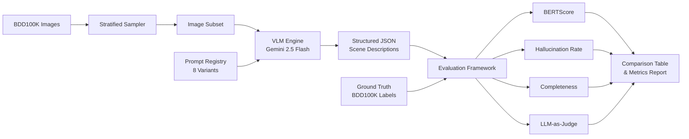

# 🚗 Driving Scene Description Generator

**Automated pipeline using Vision-Language Models to generate structured scene descriptions and meta-actions from autonomous driving images, with systematic prompt optimization and quality evaluation.**

Built for autonomous driving perception research — processes dashcam images through VLMs to produce structured scene understanding outputs suitable for training and validating AD systems.

---

## Architecture



## Key Features

- **8 systematically designed prompt variants** — from zero-shot baseline to optimized CoT+grounding combinations
- **Structured JSON outputs** — scene summaries, object detection, weather/lighting classification, hazard identification, and meta-actions (brake, accelerate, lane change, yield)
- **4-metric evaluation framework** — BERTScore semantic similarity, hallucination rate detection, completeness scoring, LLM-as-judge
- **Smart rate limiting** — designed for Gemini free tier (10 RPM / 250 RPD) with checkpoint/resume for long runs
- **Reproducible Docker pipeline** — one command to build and run

---

## Quick Start

### Prerequisites

1. **Python 3.11+**
2. **Gemini API Key** (free): Get one at [Google AI Studio](https://aistudio.google.com/apikey)
3. **BDD100K Dataset**: Register (free) at [bdd-data.berkeley.edu](https://bdd-data.berkeley.edu)

### Setup

```bash
# Clone the repo
git clone https://github.com/yourusername/driving-scene-generator.git
cd driving-scene-generator

# Install dependencies
pip install -e ".[dev]"

# Configure API key
cp .env.example .env
# Edit .env and add your GEMINI_API_KEY
```

### Download BDD100K Data

1. Register at [bdd-data.berkeley.edu](https://bdd-data.berkeley.edu)
2. Download **100K Images (Validation set)** → extract to `data/raw/images/100k/val/`
3. Download **Detection Labels** → place `bdd100k_labels_images_val.json` in `data/raw/labels/`

```
data/raw/
├── images/100k/val/    # ~10,000 .jpg files
└── labels/
    └── bdd100k_labels_images_val.json
```

### Run the Pipeline

```bash
# 1. Prepare dataset (stratified sample of 200 images)
python -m src.pipeline prepare --n 200

# 2. List available prompt variants
python -m src.pipeline list-prompts

# 3. Generate descriptions with a single prompt
python -m src.pipeline generate --prompt v1_baseline --limit 10

# 4. Run full pipeline (generate + evaluate)
python -m src.pipeline full --prompt v4_cot --limit 20

# 5. Compare all 8 prompt variants (the main experiment!)
python -m src.pipeline compare --limit 10
```

### Docker

```bash
# Build and run
docker-compose build
docker-compose run pipeline list-prompts
docker-compose run pipeline generate --prompt v1_baseline --limit 5
```

---

## Prompt Variants

| ID | Strategy | Description |
|----|----------|-------------|
| `v1_baseline` | Zero-shot basic | Simple "describe this scene" |
| `v2_structured` | Zero-shot + schema | Detailed field-by-field instructions |
| `v3_role` | Role-play | AD perception engineer persona |
| `v4_cot` | Chain-of-thought | Step-by-step reasoning |
| `v5_few_shot` | Few-shot | 2 annotated examples |
| `v6_safety` | Safety-focused | Emphasis on hazard detection |
| `v7_grounded` | Anti-hallucination | "Only report visible objects" |
| `v8_combined` | Best combination | Role + CoT + grounding |

## Evaluation Metrics

| Metric | What it Measures | Method |
|--------|-----------------|--------|
| **BERTScore F1** | Semantic similarity to GT descriptions | DeBERTa-xlarge-MNLI |
| **Hallucination Rate** | False positive/negative object categories | Set comparison vs BDD100K labels |
| **Completeness** | Coverage of required output fields | Weighted field validation |
| **LLM-as-Judge** | Overall quality rating (1-5) | Gemini self-evaluation |

## Example Output

```json
{
  "summary": "A clear daytime city street scene with moderate traffic. Several vehicles are traveling in both directions with pedestrians on the sidewalk.",
  "objects": [
    {"category": "car", "count": 4, "details": "2 ahead, 1 oncoming, 1 parked"},
    {"category": "person", "count": 2, "details": "on sidewalk to the right"},
    {"category": "traffic light", "count": 1, "details": "green light ahead"},
    {"category": "traffic sign", "count": 3, "details": "speed limit and street signs"}
  ],
  "weather": "clear",
  "lighting": "daytime",
  "road_type": "city_street",
  "hazards": ["pedestrians near roadway", "oncoming traffic"],
  "meta_actions": ["maintain_speed", "yield"]
}
```

---

## Project Structure

```
├── pyproject.toml          # Dependencies and project config
├── Dockerfile              # Multi-stage Docker build
├── docker-compose.yml      # Docker Compose orchestration
├── .env.example            # Environment variable template
├── src/
│   ├── config.py           # Settings (pydantic-settings)
│   ├── models.py           # Pydantic data models
│   ├── pipeline.py         # CLI orchestrator
│   ├── data/
│   │   ├── downloader.py   # BDD100K sampler
│   │   └── ground_truth.py # GT label parser
│   ├── vlm/
│   │   └── client.py       # Gemini API client
│   ├── prompts/
│   │   ├── templates.py    # 8 prompt variants
│   │   └── registry.py     # Prompt management
│   └── evaluation/
│       ├── bertscore.py    # Semantic similarity
│       ├── hallucination.py # Object hallucination
│       ├── completeness.py # Field coverage
│       └── judge.py        # LLM-as-judge
├── tests/
│   └── test_pipeline.py    # Unit tests
├── data/                   # Dataset (gitignored)
└── outputs/                # Results (gitignored)
```

## Tech Stack

- **Python 3.11** with type hints and Pydantic v2
- **Gemini 2.5 Flash** (free tier) for VLM inference
- **BERTScore** with DeBERTa-xlarge-MNLI for semantic evaluation
- **Docker** for reproducible deployment

---

## Rate Limit Strategy

The free Gemini tier allows ~250 requests/day. This pipeline is designed for that constraint:

| Experiment | Images | Prompts | API Calls | Days |
|-----------|--------|---------|-----------|------|
| Quick test | 5 | 1 | 5 | <1 |
| Single prompt eval | 50 | 1 | 50 | <1 |
| Full comparison | 50 | 8 | 400 | 2 |
| Production run | 200 | 1 (best) | 200 | 1 |

The pipeline supports **checkpoint/resume** — if interrupted, it picks up where it left off.

## License

MIT
