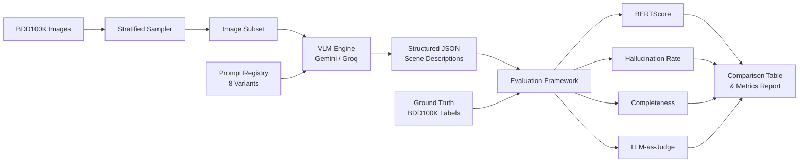
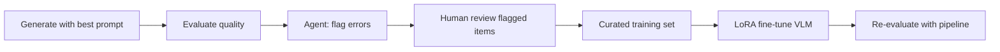

# 🚗 Driving Scene Description Generator

**Automated pipeline using Vision-Language Models to generate structured scene descriptions and meta-actions from autonomous driving images, with systematic prompt optimization and quality evaluation.**

Built for autonomous driving perception research — processes dashcam images through VLMs to produce structured scene understanding outputs suitable for training and validating AD systems.

---

## Architecture



## Key Features

- **8 systematically designed prompt variants** — from zero-shot baseline to optimized CoT+grounding combinations
- **Structured JSON outputs** — scene summaries, object detection, weather/lighting classification, hazard identification, and meta-actions (brake, accelerate, lane change, yield)
- **8-metric evaluation framework** — BERTScore semantic similarity, hallucination rate, completeness scoring, count accuracy, spatial grounding, weather/lighting accuracy, and LLM-as-judge
- **Spatial grounding evaluation** — 3×3 zone grid (left/center/right × near/mid/far) comparing VLM spatial descriptions against BDD100K bounding boxes
- **Temporal scene description** — video frame sequence processing with scene evolution tracking
- **Dual VLM backend** — supports **Gemini** (Google) and **Groq** (Llama 3.2 Vision) with one config switch
- **Smart rate limiting** — designed for free tiers: Gemini (15 RPM / 1,000 RPD) or Groq (14,400 RPD) with checkpoint/resume for long runs
- **AI error analysis agent** — detects systematic error patterns and auto-generates improved prompts
- **Reproducible Docker pipeline** — one command to build and run

---

## Quick Start

### Prerequisites

1. **Python 3.11+**
2. **VLM API Key** (free, pick one):
   - **Groq** (recommended, 14,400 RPD): Get at [console.groq.com/keys](https://console.groq.com/keys)
   - **Gemini**: Get at [Google AI Studio](https://aistudio.google.com/apikey)
3. **BDD100K Dataset**: Register (free) at [bdd-data.berkeley.edu](https://bdd-data.berkeley.edu)

### Setup

```bash
# Clone the repo
git clone https://github.com/Technocrat-dev/Driver-Scene.git
cd Driver-Scene

# Install dependencies
pip install -e ".[dev]"

# Configure API key
cp .env.example .env
# Edit .env and add your GEMINI_API_KEY
```

### Download BDD100K Data

1. Register at [bdd-data.berkeley.edu](https://bdd-data.berkeley.edu)
2. Download **100K Images (Validation set)** → extract to `data/raw/images/100k/val/`
3. Download **Detection Labels** → place `bdd100k_labels_images_val.json` in `data/raw/labels/`

```
data/raw/
├── images/100k/val/    # ~10,000 .jpg files
└── labels/
    └── bdd100k_labels_images_val.json
```

### Run the Pipeline

```bash
# 1. Prepare dataset (stratified sample of 200 images)
python -m src.pipeline prepare --n 200

# 2. List available prompt variants
python -m src.pipeline list-prompts

# 3. Generate descriptions with a single prompt
python -m src.pipeline generate --prompt v1_baseline --limit 10

# 4. Run full pipeline (generate + evaluate)
python -m src.pipeline full --prompt v4_cot --limit 20

# 5. Compare all 8 prompt variants (the main experiment!)
python -m src.pipeline compare --limit 10

# 6. AI Agent: analyze errors and suggest prompt improvements
python -m src.pipeline analyze --results outputs/<run_id>/evaluation_results_v1_baseline.json --prompt v1_baseline

# 7. Export results as fine-tuning training data
python -m src.pipeline export-training --results outputs/<run_id>/results_v4_cot.json --prompt v4_cot

# 8. Process video frame sequences for temporal scene evolution
python -m src.pipeline temporal --prompt v8_combined --limit 3
```

### Docker

```bash
# Build and run
docker-compose build
docker-compose run pipeline list-prompts
docker-compose run pipeline generate --prompt v1_baseline --limit 5
```

---

## Prompt Variants

| ID | Strategy | Description |
|----|----------|-------------|
| `v1_baseline` | Zero-shot basic | Simple "describe this scene" |
| `v2_structured` | Zero-shot + schema | Detailed field-by-field instructions |
| `v3_role` | Role-play | AD perception engineer persona |
| `v4_cot` | Chain-of-thought | Step-by-step reasoning |
| `v5_few_shot` | Few-shot | 2 annotated examples |
| `v6_safety` | Safety-focused | Emphasis on hazard detection |
| `v7_grounded` | Anti-hallucination | "Only report visible objects" |
| `v8_combined` | Best combination | Role + CoT + grounding |

## Evaluation Metrics

| Metric | What it Measures | Method |
|--------|-----------------|--------|
| **BERTScore F1** | Semantic similarity to GT descriptions | RoBERTa-large (standard default) |
| **Hallucination Rate** | False positive/negative object categories | Set comparison vs BDD100K labels |
| **Completeness** | Coverage of required output fields | Weighted field validation |
| **Weather Accuracy** | Weather classification correctness | Direct match vs BDD100K labels |
| **Lighting Accuracy** | Time-of-day classification correctness | Match with vocabulary normalization |
| **Count Accuracy (MAE)** | Object counting precision per category | Mean Absolute Error vs BDD100K counts |
| **Spatial Grounding** | Object position accuracy in 3×3 zone grid | IoU of predicted vs GT zone distributions |
| **LLM-as-Judge** | Overall quality rating (1-5) | Gemini self-evaluation |

## Example Output

```json
{
  "summary": "A clear daytime city street scene with moderate traffic. Several vehicles are traveling in both directions with pedestrians on the sidewalk.",
  "objects": [
    {"category": "car", "count": 4, "details": "2 ahead, 1 oncoming, 1 parked"},
    {"category": "person", "count": 2, "details": "on sidewalk to the right"},
    {"category": "traffic light", "count": 1, "details": "green light ahead"},
    {"category": "traffic sign", "count": 3, "details": "speed limit and street signs"}
  ],
  "weather": "clear",
  "lighting": "daytime",
  "road_type": "city_street",
  "hazards": ["pedestrians near roadway", "oncoming traffic"],
  "meta_actions": ["maintain_speed", "yield"]
}
```

---

## Project Structure

```
├── pyproject.toml          # Dependencies and project config
├── Dockerfile              # Multi-stage Docker build
├── docker-compose.yml      # Docker Compose orchestration
├── .env.example            # Environment variable template
├── src/
│   ├── cli.py              # CLI argument parsing & dispatch
│   ├── config.py           # Settings (pydantic-settings)
│   ├── models.py           # Pydantic data models
│   ├── pipeline.py         # Pipeline orchestrator (generate, evaluate, compare)
│   ├── data/
│   │   ├── downloader.py   # BDD100K sampler
│   │   ├── ground_truth.py # GT label parser (enriched descriptions)
│   │   └── temporal.py     # Video frame sequence processing
│   ├── vlm/
│   │   ├── __init__.py     # VLM client factory (Gemini / Groq)
│   │   ├── client.py       # Gemini API client + rate limiter
│   │   └── groq_client.py  # Groq API client (Llama Vision)
│   ├── prompts/
│   │   ├── templates.py    # 8 prompt variants
│   │   └── registry.py     # Prompt management
│   ├── evaluation/
│   │   ├── bertscore.py    # Semantic similarity
│   │   ├── hallucination.py # Object hallucination
│   │   ├── completeness.py # Field coverage
│   │   ├── count_accuracy.py # Object count MAE & ratio
│   │   ├── spatial.py      # 3×3 zone spatial grounding
│   │   └── judge.py        # LLM-as-judge
│   └── agent/
│       └── analyzer.py     # AI agent: error analysis & prompt improvement
├── tests/
│   ├── test_pipeline.py    # Unit tests (models, evaluation, prompts, agent)
│   └── test_integration.py # Integration tests (full evaluate + export flow)
├── dashboard/
│   ├── index.html          # Results visualization
│   ├── styles.css          # Dashboard styling
│   └── app.js              # Chart rendering + data loading
├── data/                   # Dataset (gitignored)
└── outputs/                # Results (gitignored)
```

## AI Agent (MLOps Support)

The `analyze` command runs an AI agent that:
1. **Detects error patterns** — hallucination biases, weather/lighting confusion, completeness gaps
2. **Generates analysis reports** — strengths, weaknesses, and severity-ranked patterns
3. **Suggests prompt improvements** — actionable text additions to address found issues
4. **Auto-improves prompts** — appends correction instructions based on error analysis

```bash
# Analyze evaluation results
python -m src.pipeline analyze --results outputs/<run>/evaluation_results_v1_baseline.json

# Analyze + auto-generate improved prompt
python -m src.pipeline analyze --results outputs/<run>/evaluation_results_v1_baseline.json --prompt v1_baseline

# Save report to JSON
python -m src.pipeline analyze --results outputs/<run>/evaluation_results_v1_baseline.json --save report.json
```

## Tech Stack

- **Python 3.11** with type hints and Pydantic v2
- **Groq** (Llama 4 Scout 17B, free tier, 14,400 RPD) — recommended VLM backend
- **Gemini 2.5 Flash-Lite** (free tier, 1,000 RPD) — alternative VLM backend
- **BERTScore** with RoBERTa-large for semantic evaluation
- **Docker** for reproducible deployment

---

## Rate Limit Strategy

The pipeline is designed for free-tier API constraints with smart rate limiting and checkpoint/resume:

| Provider | RPD | RPM | 8-variant × 10 images | Notes |
|----------|-----|-----|----------------------|-------|
| **Groq** (recommended) | 14,400 | 30 | ~3 minutes | Proactive sliding-window limiter |
| **Gemini** | ~1,000 | 15 | 18+ minutes | Exponential backoff on 429s |

| Experiment | Images | Prompts | API Calls | Time (Groq) |
|-----------|--------|---------|-----------|-------------|
| Quick test | 5 | 1 | 5 | <1 min |
| Single prompt eval | 50 | 1 | 50 | ~2 min |
| Full comparison | 50 | 8 | 400 | ~15 min |
| Production run | 200 | 1 (best) | 200 | ~8 min |

The pipeline supports **checkpoint/resume** — if interrupted, it picks up where it left off.

---

## Results Dashboard

An interactive HTML dashboard for visualizing prompt comparison results:

```bash
# Open in browser after running the comparison
start dashboard/index.html    # Windows
open dashboard/index.html     # macOS
```

**Features:**
- Bar charts comparing all 8 prompts across BERTScore, completeness, and hallucination rate
- Radar chart showing metric tradeoffs for the top 3 prompts
- Weather and lighting accuracy comparison
- Color-coded comparison table with best-prompt highlighting
- AI agent analysis viewer with error pattern details

Load `comparison_table.json` from your outputs folder via the "Load Results" button.

---

## Fine-Tuning Integration

While this project focuses on prompt engineering, the pipeline's structured output is designed to feed directly into VLM fine-tuning workflows:

### Output → Training Data

The pipeline's `results_*.json` files contain image-description pairs in a format convertible to SFT (Supervised Fine-Tuning) data:

```python
# Convert pipeline output to messages format for fine-tuning
{"messages": [
    {"role": "user", "content": [image_bytes, prompt_text]},
    {"role": "assistant", "content": json.dumps(scene_description)}
]}
```

### Recommended Fine-Tuning Approaches

| Method | Parameters | Use Case |
|--------|-----------|----------|
| **Full Fine-Tuning** | All weights | Large datasets (10k+ samples), maximum quality |
| **LoRA** | ~0.1% of weights | Moderate datasets (1-5k), good quality/cost tradeoff |
| **QLoRA** | ~0.1% (4-bit base) | Limited GPU memory, minimal quality loss |
| **Prompt Tuning** | Soft prompt only | Very small datasets, preserves base model |

### Pipeline-Assisted Fine-Tuning Workflow



The AI agent's error analysis identifies systematic failure modes (e.g., hallucinated bus detections), which pinpoint exactly what training data to collect for targeted improvement.

## Future Work

- **Multi-model comparison** — Benchmark across GPT-4V, Claude, and open-source VLMs (LLaVA, Qwen-VL) on the same evaluation framework.
- **Fine-tuning loop** — Use the exported training data (JSONL) to LoRA fine-tune a VLM and re-evaluate with the pipeline, completing the full improvement cycle.
- **Confidence calibration** — Add confidence scores to VLM outputs and evaluate calibration against ground truth accuracy.

## References

- **BDD100K Dataset**: Yu, F. et al. "BDD100K: A Diverse Driving Dataset for Heterogeneous Multitask Learning." *CVPR 2020*. [arXiv:1805.04687](https://arxiv.org/abs/1805.04687)
- **BERTScore**: Zhang, T. et al. "BERTScore: Evaluating Text Generation with BERT." *ICLR 2020*. [arXiv:1904.09675](https://arxiv.org/abs/1904.09675)
- **LLM-as-Judge**: Zheng, L. et al. "Judging LLM-as-a-Judge with MT-Bench and Chatbot Arena." *NeurIPS 2023*. [arXiv:2306.05685](https://arxiv.org/abs/2306.05685)
- **Chain-of-Thought Prompting**: Wei, J. et al. "Chain-of-Thought Prompting Elicits Reasoning in Large Language Models." *NeurIPS 2022*. [arXiv:2201.11903](https://arxiv.org/abs/2201.11903)

## License

MIT
